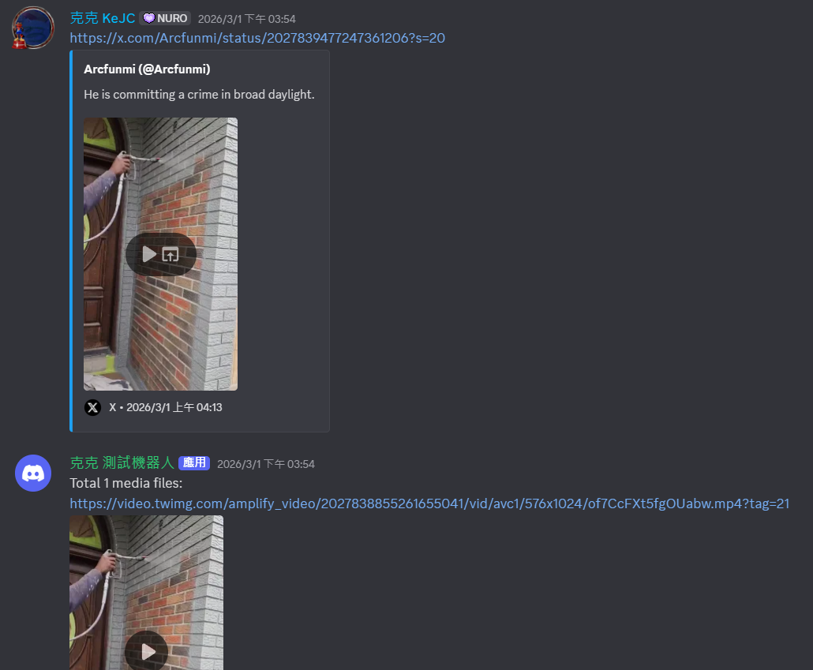
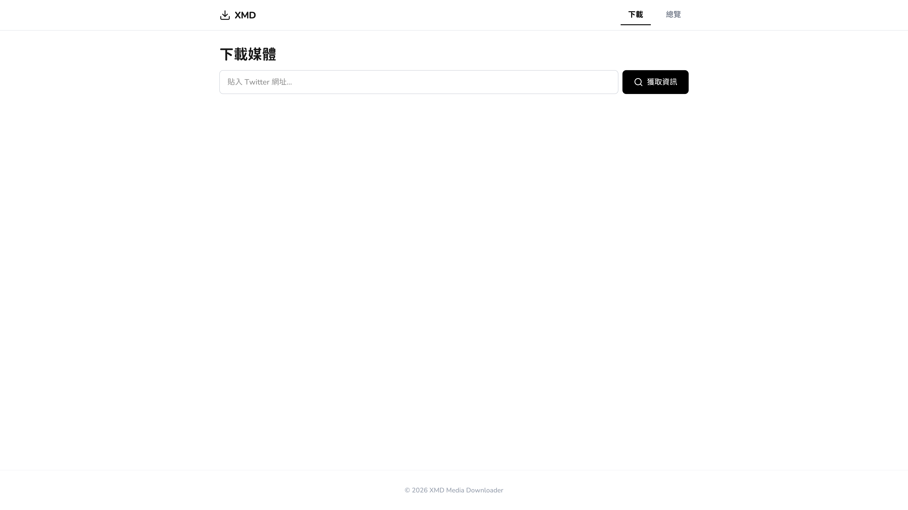
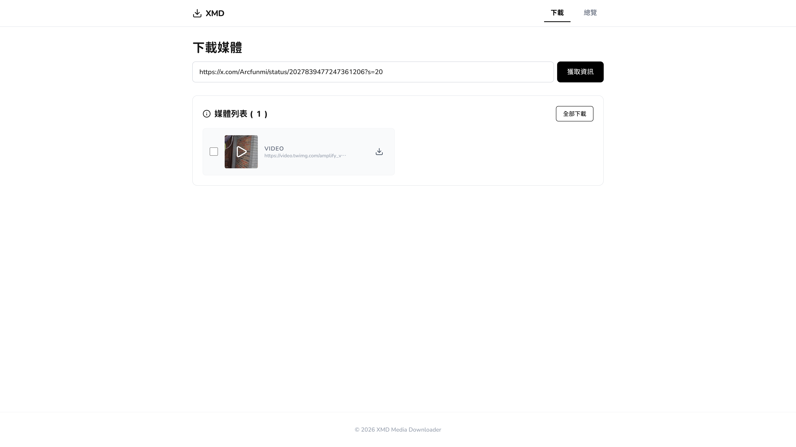

<h1 align="center">XMD (X Media Downloader)</h1>

<p align="center">
一個基於 Python，整合 Discord 機器人與 Web 介面的 <strong>X (Twitter) 媒體下載器</strong>。
</p>

<div align="center">


[](../LICENSE) <br>
[](./README_zh-tw.md)
[](../README.md)

</div>

## 🖥️ Demo

- Discord 機器人


- Web 介面



## 🌟 特色

- **自動與手動雙模式**
    - **自動下載**：將 Discord 頻道透過 `/set_channel` 設定為「推文下載頻道」，只要偵測到 X 的連結就會立即自動下載媒體。
    - **手動下載**：使用 `/download` 指令，可以預覽貼文內容並選擇下載特定媒體(或全部)。
- **多語言支持 (i18n)**
    - Discord 指令支援 **繁體中文**、**簡體中文**、**英文**。
- **Web 前端管理**
    - 內建 FastAPI 驅動的 Web 服務，方便搜尋與查看下載歷史。

## 🛠️ 技術使用

- python 3.12
- fastapi (用於提供 Web 介面)
- typescript (用於提供 Web 介面)
- tailwindcss (用於提供 Web 介面)
- sqlite3 (用於提供資料庫)
- 該專案已將前端放置 frontend/，而有關於 fastapi, discord 都已經將他們分為多個組件，位於 src/services/，並且當中的 main.py 都繼承來自 src/abc.py 的 **ServicesABC**。

## 🚀 使用

### 1. 準備工作

- 確保已安裝 Python 3.12 以上版本。
- 確保已安裝 Node.js。
- 推薦使用 [uv](https://github.com/astral-sh/uv)。

### 2. 下載專案

```bash
git clone https://github.com/NotKeKe/XMD.git
cd XMD
```

### 3. 前端 build

為了節省專案下載時間，所以該專案並沒有直接提供前端網頁的 build 結果  
請根據以下指示去 build 前端網頁：  
1. 進入 `frontend` 目錄：`cd frontend`
2. 安裝依賴：`npm install`
3. 執行建置：
   - TypeScript: `npm run build`
   - CSS (Tailwind): `npm run build:css`

### 3. 設定

- 修改你的 config.toml: [config.toml 的介紹](#configtoml-description)。
- 創建 `data/` 資料夾。
- 創建 `data/cookies.json`
    - 於網頁中登入 X (Twitter)。
    - 取得 cookies (我自己是在 chrome 使用 [cookies editor](https://chromewebstore.google.com/detail/hlkenndednhfkekhgcdicdfddnkalmdm?utm_source=item-share-cb) 擴充功能去取得的，如果你有自己的方法也可以。)
    - 將 **X (Twitter) 的 Cookie** 填入 `data/cookies.json`。
    - 格式應該如下:
    ```json
    {
    	"auth_token": "",
    	"ct0": ""
        ... # 其他 cookie 的鍵值對
    }
    ```

### 4. 啟動

- **使用 uv (推薦)**
    - 同步虛擬環境：`uv sync`
    - 執行程式：`uv run main.py`

- **使用 pip**
    - 安裝依賴：`pip install -r requirements.txt`
    - 執行程式：`python main.py`

## 📜 Discord 指令說明

- `/set_channel`：開啟或關閉當前頻道的自動下載功能。
- `/download <url>`：解析並下載指定的推文媒體。
- `/my_id`：查詢你的 Discord 使用者 ID。
- `/help`：顯示完整的指令幫助訊息。

<div id="configtoml-description"></div>

## 📝 config.toml 說明

- **第一次開啟**
    - 在第一次啟動程式後，應該會看到當前目錄產生了一個 `config.toml`，並且程式自動退出。
- **services_open**
    - 其中特別需要注意的是 `services_open`，底下有 discord 與 fastapi(網頁介面)，請至少將其中一項設定為 true (代表開啟)，不然這個專案無法運行。
    - 如果你在 `services_open` 中開啟了 discord，請務必到 `discord` 的基礎配置，填寫上你的 **bot_token**
        - 如果你還不會創建 Discord Bot，請參閱[這篇介紹](https://github.com/NotKeKe/TuneZ-Discord-Bot/blob/main/assets/docs/Register_Discord_Bot/Register_Discord_Bot.md)。
- <strong>*_only_you</strong> (很重要的選項，務必閱讀!!!):
    - (`*_only_you`，例如: `x_only_you`, `discord_only_you`)
    - 如果你想讓 X 或是 Discord 的 Bot 可以回覆所有人的訊息，你可以將 `twitter` 與 `discord` 底下的 `*_only_you` 設定為 `false`。
    - **風險**: 如果你讓 bot 可以回覆所有人的訊息有一個風險，因為我預設是會將任何 media 直接下載至本地電腦的，所以有可能因此被**惡意攻擊**(例如多次呼叫命令，導致電腦硬碟空間不足)。如果可以的話，<strong>請在設定完 user_id 後立刻將 *_only_you 改回 true</strong>。
- **user_id**:
    - 你應該可以看到在 `twitter` 跟 `discord` 底下都有 **user_id**，該專案預設只會回覆 "YOUR_USER_ID" 的訊息，所以請務必將他替換為你自己的 ID。
        - (Discord 的 ID 可以在 Discord 程式中，對著自己的頭像按右鍵，選擇「複製使用者 ID」，或是於 discord bot 開啟後，使用 `/my_id` 指令查詢。)

## 後言

**❗請勿將該專案用於任何如侵犯他人版權，或其他可能違法之用途，如有違規，本人概不負責。❗**
- **如果你覺得這個專案有幫助，記得給我一個 Star 🌟 來鼓勵我 !**
- **如果你在專案中使用了這個工具或進行二次分發，也請記得標註來源或 Tag 我，感謝支持！**
- 遇到任何 Bug 或有建議，歡迎提交 [Issue](https://github.com/NotKeKe/XMD/issues)。
